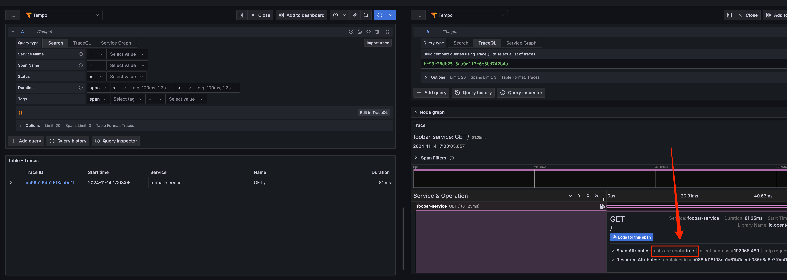

# How to build and test

## Build the image docker.io/library/otel-agent-without-bp-foobar-service

```shell
docker-compose build
```

## Start the service & otel-infrastructure

```shell
docker-compose up -d
```

## Call controller to create a trace

```shell
curl --location 'localhost:8080'
```

## Check if single span of trace has property set

The `CatsAreCoolSpanProcessor` is part of my own extension which itself is re-packaged together with the
`io.opentelemetry.javaagent:opentelemetry-javaagent` and should attach a simple property to all spans: 

```
cats.are.cool=true
```

Grafana is locally running under [localhost:51423](http://localhost:51423/explore?schemaVersion=1&panes=%7B%22usy%22:%7B%22datasource%22:%22tempo%22,%22queries%22:%5B%7B%22refId%22:%22A%22,%22datasource%22:%7B%22type%22:%22tempo%22,%22uid%22:%22tempo%22%7D,%22queryType%22:%22traceqlSearch%22,%22limit%22:20,%22tableType%22:%22traces%22,%22filters%22:%5B%7B%22id%22:%2290a99db0%22,%22operator%22:%22%3D%22,%22scope%22:%22span%22%7D%5D%7D%5D,%22range%22:%7B%22from%22:%22now-1h%22,%22to%22:%22now%22%7D%7D,%22olv%22:%7B%22datasource%22:%22tempo%22,%22queries%22:%5B%7B%22query%22:%22bc99c26db25f3aa9d1f7c6e3bd742b4a%22,%22queryType%22:%22traceql%22,%22refId%22:%22A%22,%22limit%22:20,%22tableType%22:%22traces%22%7D%5D,%22range%22:%7B%22from%22:%221731596600436%22,%22to%22:%221731600200436%22%7D%7D%7D&orgId=1). Username and Password is `admin`. 

Should look like 



